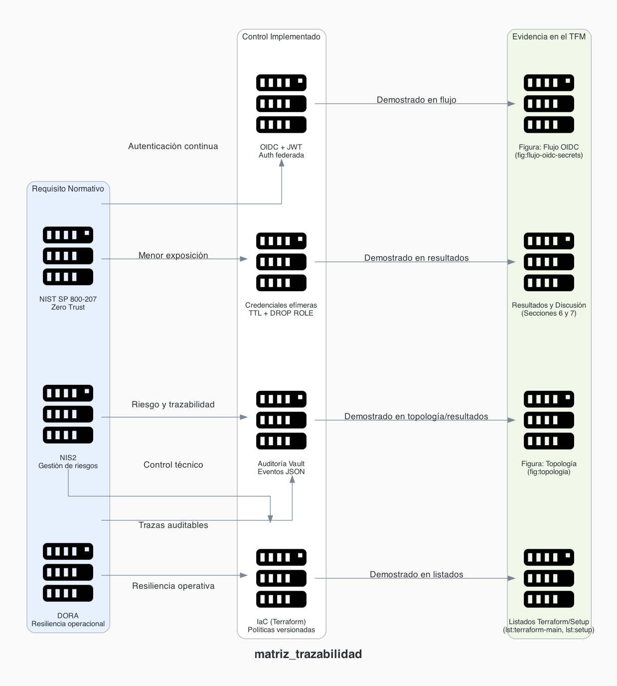
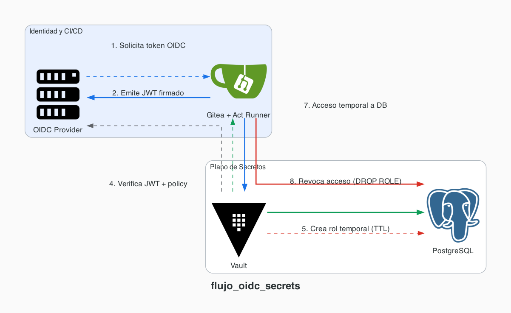

# TFM: Secret Sprawl y Gestión Dinámica de Secretos

**Andrea Osma Rafael**  
Máster en Ciberseguridad

---
# 1. Problema

## Secret Sprawl en entornos DevSecOps

- Secretos en código, variables y pipelines.
- Credenciales estáticas que duran demasiado.
- Baja trazabilidad de accesos reales.

**Efecto:** mayor superficie de exposición y más impacto potencial ante filtración.

---
# 2. Marco de referencia

- **NIST SP 800-207 (Zero Trust):** decisión dinámica por solicitud.
- **NIS2** y **DORA:** controles demostrables, resiliencia y trazabilidad.

La seguridad deja de centrarse en el perímetro y pasa a centrarse en la **identidad**.

---
# 3. Hipótesis y tesis

## Hipótesis

- Identidad federada + bóveda criptográfica reduce exposición.
- Credenciales efímeras reducen tiempo útil de abuso.

## Tesis

Sustituir secretos persistentes por flujos de emisión dinámica integrados en CI/CD.

---
# 4. Diseño lógico (3 planos)

1. **Autenticación:** OIDC/JWT para identidad de máquina.
2. **Autorización:** políticas mínimas (*Policy-as-Code*).
3. **Emisión dinámica:** credenciales efímeras con TTL y revocación.

---
# 5. Laboratorio on-premise (topología)

- Proxmox como base de laboratorio reproducible.
- LXC: Gitea/Runner, Vault y PostgreSQL.
- VM: k3s para carga de trabajo.


---
# 6. Trazabilidad normativa -> control -> evidencia

Relación explícita entre requisito regulatorio, control técnico aplicado y evidencia del TFM.



---
# 7. Secret Zero sin hardcoding

## Dilema

¿Cómo entregar el primer vector de autenticación sin dejar secretos persistentes?

## Respuesta

- Federación de identidad con OIDC.
- Validación criptográfica en Vault.
- Emisión de credenciales efímeras bajo política.

---
# 8. Flujo OIDC -> Vault -> PostgreSQL

Secuencia completa de autenticación federada, emisión temporal y revocación.



---
# 9. Código: preparación del host

```bash
#!/bin/bash
set -euo pipefail
apt-get update && apt-get install -y gnupg software-properties-common curl wget

ISO_DIR="/var/lib/vz/template/iso"
mkdir -p "$ISO_DIR"
if [ ! -w "$ISO_DIR" ]; then
  echo "[ERROR] Sin permisos de escritura en $ISO_DIR"
  exit 1
fi
```

Fuente: `../../code/setup_proxmox.sh`

---
# 10. Código: Terraform para despliegue reproducible

```hcl
provider "proxmox" {
  endpoint = var.proxmox_endpoint
  insecure = var.proxmox_insecure
}

resource "proxmox_virtual_environment_container" "lxc_gitea" {
  vm_id = var.vm_ids.gitea
  initialization {
    ip_config { ipv4 { address = var.lab_ipv4.gitea gateway = var.lab_ipv4.gateway } }
    user_account { keys = [var.ssh_public_key] }
  }
}
```

Fuente: `../../code/terraform/main.tf`

---
# 11. Resultados: emisión dinámica y revocación

- El runner recibe credenciales de vida corta (TTL).
- Al expirar TTL o cerrar job, se revoca el rol en DB (**DROP ROLE**).
- Se reduce la persistencia de credenciales reutilizables.

---
# 12. Resultados: auditoría y detección

- Vault registra eventos en JSON (identidad, policy, ruta, timestamp).
- La traza es utilizable para correlación en SIEM.
- Se facilita investigación y detección de patrones anómalos.

---
# 13. Resultados: reproducibilidad con IaC

- Entorno levantado desde scripts + Terraform versionados.
- Menor deriva operativa entre ejecuciones.
- Evidencia técnica más fácil de auditar.

---
# 14. Discusión

- La hipótesis principal queda respaldada en laboratorio.
- Mejora clara frente a secretos estáticos en CI/CD.
- Limitación: falta ampliar medición cuantitativa avanzada.

---
# 15. Trabajo futuro

- Más escenarios de fallo (OIDC, políticas, auditoría).
- Métricas de latencia/distribución y estabilidad.
- Correlación real de eventos en SIEM operativo.

---
# 16. Conclusiones

- Viable erradicar secretos persistentes en este contexto.
- Se resuelve Secret Zero sin hardcoding.
- El enfoque combina seguridad técnica y trazabilidad de cumplimiento.

**Q&A**
