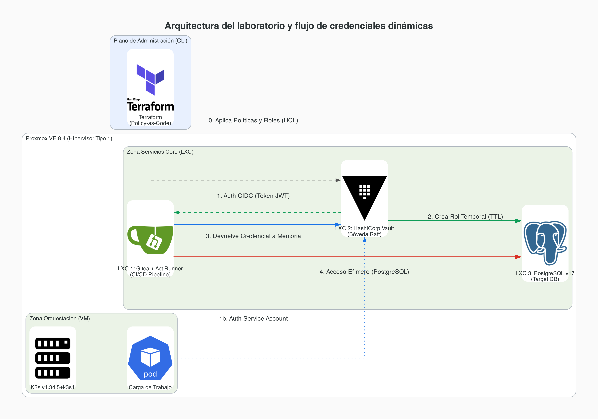

---
# TFM: Secret Sprawl y Gestión Dinámica de Secretos

**Andrea Osma Rafael**  
Máster en Ciberseguridad  

---

---
# 1. Problema

## Secret Sprawl en entornos DevSecOps

La proliferación descontrolada de credenciales (tokens, certificados, llaves, contraseñas) aparece durante el **SDLC** y se amplifica en **CI/CD**:

- Secret “hardcoded” o commit accidental en repositorios
- Variables de entorno inseguras en servidores de build
- Credenciales estáticas con falta de rotación

## Efecto

Mayor superficie de exposición y riesgo de persistencia tras una intrusión.

---

---
# 2. Marco de referencia (Zero Trust + normativa)

- **NIST SP 800-207 (Zero Trust)**: evaluación dinámica y continua de accesos
- **NIS2** y **DORA**: exigencias de controles demostrables, resiliencia y auditoría

## Idea clave

La seguridad debe desplazarse desde el perímetro hacia la **identidad**.

---

---
# 3. Hipótesis

- Una arquitectura centrada en **identidad** + una bóveda criptográfica puede **reducir** la superficie de ataque en entornos con requisitos estrictos.
- La emisión de credenciales **dinámicas** reduce el tiempo útil de abuso.
- La inserción transversal de controles en el pipeline (shift-left) mejora la postura de seguridad del SDLC.

---

---
# 4. Tesis / Solución propuesta

## Arquitectura DevSecOps para Gestión Dinámica de Secretos

### Objetivo

Sustituir credenciales estáticas por **flujos de inyección dinámica** orquestados con **IaC**.

---

---
# 5. Diseño lógico (3 planos)

## Arquitectura en capas

1. **Plano de Autenticación**  
   Identidades nativas (p. ej., tokens **JWT** mediante **OIDC**).

2. **Plano de Autorización**  
   Motor de políticas (*Policy-as-Code*) con privilegios mínimos.

3. **Plano de Emisión Dinámica**  
   Credenciales efímeras bajo demanda con **TTL**.

---

---
# 6. “Secret Zero” sin hardcoding

## Dilema

¿Cómo entregar el primer vector de autenticación sin secretos persistentes?

## Solución

- El pipeline presenta un token firmado temporalmente (federación de identidades)
- La bóveda valida la firma y emite credenciales efímeras
- Los manifiestos y el código permanecen **limpios** de material criptográfico persistente

---

---
# 7. Laboratorio on-premise (topología)

**Infraestructura** sobre **Proxmox** con contenedores y VMs.

Incluye:

- **LXC 1**: Gitea + Act Runner (CI/CD) -> emite tokens OIDC
- **LXC 2**: HashiCorp Vault (motor + almacenamiento con Raft)
- **LXC 3**: PostgreSQL (sistema objetivo)
- **VM 1**: clúster **k3s** / Kubernetes



---

---
# 8. IaC e inmutabilidad operativa

### ¿Cómo se construye?

- **Terraform (HCL)** para orquestar topología y seguridad
- Estado y configuración gestionados como código
- Despliegue reproducible y auditable mediante revisiones

Resultado esperado: menos deriva operativa y cambios consistentes.

---

---
# 9. Código: preparación del host (Proxmox)

Script de inicialización (instala dependencias base y prepara imágenes Cloud-Init):

```bash
#!/bin/bash
set -e

apt-get update && apt-get install -y gnupg software-properties-common curl wget sshpass

# Añadir repositorio de HashiCorp
wget -O- https://apt.releases.hashicorp.com/gpg | gpg --dearmor | tee /usr/share/keyrings/hashicorp-archive-keyring.gpg >/dev/null
echo "deb [signed-by=/usr/share/keyrings/hashicorp-archive-keyring.gpg] https://apt.releases.hashicorp.com $(lsb_release -cs) main" | tee /etc/apt/sources.list.d/hashicorp.list

# Instalar Terraform y Ansible
apt-get update
apt-get install -y terraform ansible

# Descargar imagen Debian 12 Cloud-Init a local
ISO_DIR="/var/lib/vz/template/iso"
DEBIAN_IMG="debian-12-genericcloud-amd64.img"
URL="https://cloud.debian.org/images/cloud/bookworm/latest/debian-12-genericcloud-amd64.qcow2"
...
```

Fuente: `code/setup_proxmox.sh`

---

---
# 10. Código: Terraform (containers + claves en `user_account`)

Ejemplo de configuración de **LXC** e inyección de claves:

```hcl
terraform {
  required_providers {
    proxmox = {
      source  = "bpg/proxmox"
      version = "~> 0.46.1"
    }
  }
}

provider "proxmox" {
  endpoint = var.proxmox_endpoint
  insecure = true
}

resource "proxmox_virtual_environment_container" "lxc_gitea" {
  node_name = var.proxmox_node
  vm_id     = 501

  initialization {
    hostname = "gitea-runner"
    ...
    user_account {
      keys = [var.ssh_public_key]
    }
  }
}
```

Fuente: `code/terraform/main.tf`

---

---
# 11. Flujo de emisión dinámica (Vault -> PostgreSQL)

## Secuencia

- CI/CD se autentica mediante federación (**OIDC**)
- Vault usa el **Database Secrets Engine**:
  - crea un rol efímero con permisos mínimos
  - entrega credenciales al runner en ejecución
- Al expirar el **TTL** o finalizar el job:
  - Vault ejecuta **DROP ROLE**
  - elimina el acceso efímero

---

---
# 12. Auditoría y detección

## Trazabilidad “lista para correlación”

- Vault habilita auditoría en **JSON**
- Se registran campos como:
  - identidad solicitante
  - política evaluada
  - ruta del secreto
  - timestamp
- En el enfoque del laboratorio:
  - exportación/correlación hacia sistemas tipo **SIEM**

---

---
# 13. Resultados (1/3): TTL y revocación

### Evidencia funcional

- La lógica de emisión/revocación está gobernada por manifiestos Terraform
- Se valida que, al finalizar el job o expirar el TTL:
  - el acceso se revoca en PostgreSQL con **DROP ROLE**
  - se elimina el rol efímero

---

---
# 14. Resultados (2/3): trazabilidad de auditoría

### Evidencia funcional

- La auditoría de Vault registra interacciones en formato JSON consistente
- Esto habilita la correlación de eventos para:
  - detección de intentos fallidos
  - identificación de patrones de acceso no esperados

---

---
# 15. Resultados (3/3): reproducibilidad con IaC

### Evidencia funcional

- Entorno reproducible desde:
  - scripts versionados
  - manifiestos Terraform
- Menor deriva operativa y cambios auditables vía control de versiones

---

---
# 16. Discusión: hipótesis y relación con Secret Sprawl

- La credencial efímera reduce el tiempo útil de abuso
- La prevención + trazabilidad mitigan la materialización de Secret Sprawl
- Alineación con prácticas de secret management y secret scanning

---

---
# 17. Discusión: limitaciones

- Estudio en entorno específico on-premise (Proxmox, LXC, Vault, PostgreSQL, k3s)
- No se detalla una medición cuantitativa estadística de:
  - latencias
  - distribución de tiempos
  - tasa de falsos positivos
- La validez externa depende de replicar configuración y calidad de políticas

---

---
# 18. Trabajo futuro

- Añadir métricas cuantitativas y más casos de fallo:
  - denegaciones por políticas
  - problemas de validación OIDC
  - fallos transitorios del motor de auditoría
- Correlación real de eventos hacia SIEM
- Extender a otras superficies de secretos:
  - certificados, llaves de cifrado, credenciales de servicios

---

---
# 19. Conclusiones

- Se demuestra la viabilidad técnica de erradicar secretos estáticos
- El “Secret Zero” se resuelve sin hardcoding persistente
- La seguridad se integra en el ciclo de vida mediante IaC, identidad dinámica y auditoría

**Q&A**

---

